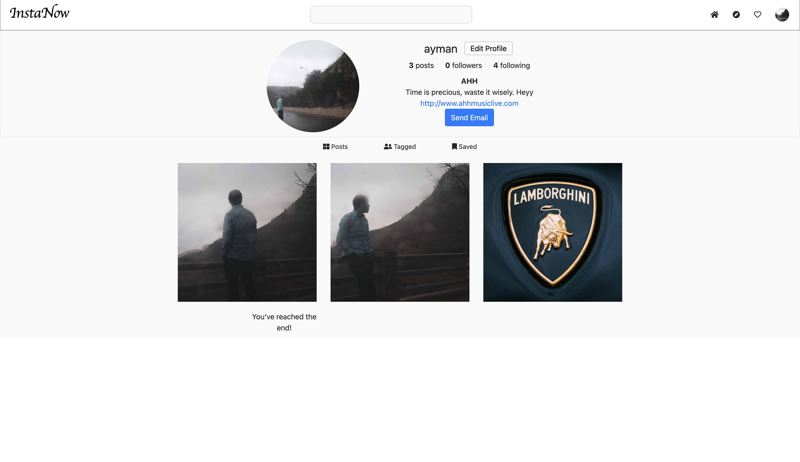

# Insta Now

An Instagram clone built using Django and Javascript.

### Features

- Login/Sign up
- Post
- Like, comment and save
- Notifications
- Edit Profile
- Explore page
- Infinite scroll
- Follow/Unfollow

### Screenshots

| Home Page                   |
| --------------------------- |
|  |

| Explore Page                   |
| ------------------------------ |
|  |

| Post #1                      |
| ---------------------------- |
|  |

| Post #2 (with comment)       |
| ---------------------------- |
|  |

| Profile Page (user)                         |
| ------------------------------------------- |
|  |

| Profile Page                         |
| ------------------------------------ |
|  |
